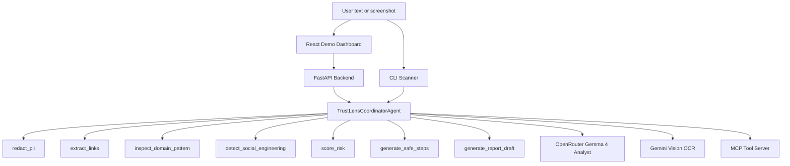

<div align="center">
  
</div>

# TrustLens Agent

**TrustLens** is an AI Security Concierge for suspicious SMS, email, chat, DM, and screenshot threats. It combines a Google ADK-style agent pipeline, privacy-first local guardrails, optional Gemini OCR, optional OpenRouter Gemma analysis, a FastAPI backend, a React demo dashboard, a CLI, and an MCP tool server.

TrustLens is not a link checker. It is a context-aware recovery agent that translates suspicious-message evidence into human-safe next steps.

## Key Features

1. **Multimodal Vision OCR**: Screenshot messages can be transcribed with Gemini Vision before analysis.
2. **OpenRouter Gemma 4 Analyst**: Optional hosted Gemma enrichment adds plain-language explanation, evidence notes, clarifying questions, and action priority.
3. **Marked Fallback Mode**: If Gemini or OpenRouter is unavailable, TrustLens uses deterministic fallbacks and clearly labels them.
4. **Evidence Analytics Dashboard**: Shows link count, maximum domain risk, social engineering hooks, AI route, confidence, and trace depth.
5. **Local Case History**: Stores anonymized investigations in browser localStorage so users can reopen recent cases.
6. **Export & Share**: Copies incident reports, copies short share summaries, and exports full JSON case packets.
7. **Privacy-First PII Redaction**: Masks emails, phone numbers, cards, CNPs, and SSNs before external model enrichment.
8. **Offline Domain Inspection**: Detects typosquatting, brand impersonation, suspicious TLDs, hyphen-heavy domains, and digit-heavy domains without opening links.
9. **Situation-Aware Safety Planner**: Adjusts next steps for prevention, clicked-link inspection, or compromised-data recovery.
10. **MCP Tool Server**: Exposes the core scanner tools to MCP-compatible clients.

## Architecture



## Setup

Requirements:

* Python 3.10+
* Node.js 18+

Install the Python package and dependencies:

```bash
python -m pip install -e .
```

Create `.env` from `.env.example` and add the providers you want:

```bash
GEMINI_API_KEY=your_gemini_key_for_screenshot_ocr
OPENROUTER_API_KEY=your_openrouter_key_for_gemma_analysis
OPENROUTER_MODEL=google/gemma-4-31b-it:free
```

Both keys are optional. The app still runs without them and marks fallback mode in the UI.

Start the backend:

```bash
python backend/run.py
```

Open:

```txt
http://127.0.0.1:8000
```

## AI Runtime Options

TrustLens keeps provider keys server-side.

| Capability | Provider | Env var | Fallback |
| :--- | :--- | :--- | :--- |
| Screenshot OCR | Gemini 2.5 Flash | `GEMINI_API_KEY` | Safe demo OCR fixtures |
| Analyst enrichment | OpenRouter Gemma 4 | `OPENROUTER_API_KEY`, `OPENROUTER_MODEL` | Deterministic evidence summary |

The React client never receives provider keys. It calls the FastAPI backend and displays whether Gemini/OpenRouter are live or in fallback mode.

## Frontend Development

The production frontend is already built into `web/dist` and served by FastAPI. For live frontend edits:

```bash
cd web
npm install
npm run dev
```

The Vite dev server connects to the FastAPI backend on port 8000.

## CLI Scanner

Run a sample scan:

```bash
trustlens scan --sample courier
```

Equivalent module form:

```bash
python -m trustlens_agent.cli scan --sample courier
```

Available samples:

* `courier`
* `bank`
* `lottery`
* `romance`

Custom scan:

```bash
trustlens scan --text "URGENT: Click here to verify your account now http://secure-bt-portal.xyz" --situation clicked_only
```

## MCP Server

Start the MCP server on stdin/stdout:

```bash
trustlens-mcp
```

Equivalent module form:

```bash
python -m trustlens_agent.mcp_server
```

Example Claude Desktop configuration:

```json
{
  "mcpServers": {
    "trustlens-security": {
      "command": "python",
      "args": ["-m", "trustlens_agent.mcp_server"],
      "env": {
        "GEMINI_API_KEY": "your_gemini_key",
        "OPENROUTER_API_KEY": "your_openrouter_key"
      }
    }
  }
}
```

## Capstone Alignment

| Requirement | TrustLens Implementation |
| :--- | :--- |
| ADK Agent & Tools | Coordinator pipeline with Python security tools and visible ADK agent definition. |
| MCP Server | JSON-RPC MCP server exposing PII redaction, link extraction, domain inspection, social engineering detection, scoring, planning, and reporting. |
| Safety & Privacy | Local PII redaction, zero-trust offline domain parsing, no link opening, and marked model fallbacks. |
| Deployability | Single FastAPI app serving the built React demo, plus Docker-ready files. |
| User Experience | Evidence analytics, Gemma analyst panel, local case history, export/share controls, and situation-aware recovery steps. |

## Verification

Run:

```bash
python -m unittest discover -s tests
python -m compileall src backend
cd web && npm run lint && npm run build
```

Presentation docs:

* `docs/video_script.md`
* `docs/presentation_deck.md`
* `docs/epic_roadmap.md`
