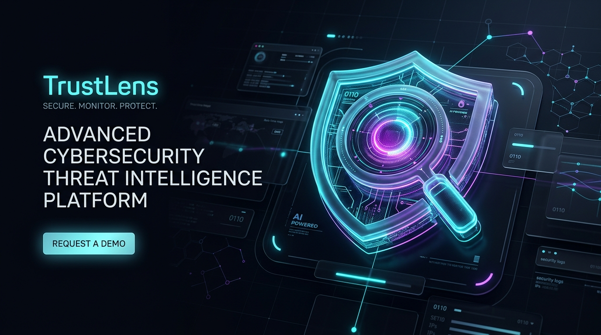
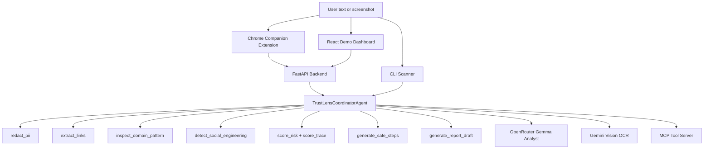

<div align="center">
  
</div>

# TrustLens Agent

**TrustLens** is an AI Security Concierge for suspicious SMS, email, chat, DM, and screenshot threats. It combines a Google ADK-style agent pipeline, privacy-first local guardrails, optional Gemini OCR, optional OpenRouter Gemma analysis, a FastAPI backend, a React demo dashboard, a CLI, and an MCP tool server.

TrustLens is not a link checker. It is a context-aware recovery agent that translates suspicious-message evidence into human-safe next steps.

## Current Release

* Version: `1.0.3`
* Public static demo target: `https://pixek.xyz/trustlens/`
* Repository: `https://github.com/git-clowie/trustlens-agent`
* Static hosting: `web/dist` is safe to upload at a domain root or inside a subpath.
* Live AI mode: Gemma and Gemini require a FastAPI backend with provider keys kept server-side.

## Key Features

1. **Multimodal Vision OCR**: Screenshot messages can be transcribed with Gemini Vision before analysis.
2. **OpenRouter Gemma 4 31B Analyst**: Optional hosted Gemma enrichment adds plain-language explanation, evidence notes, clarifying questions, and action priority.
3. **Marked Fallback Mode**: If Gemini or OpenRouter is unavailable, TrustLens uses deterministic fallbacks and clearly labels them.
4. **Evidence Analytics + Score Trace**: Shows link count, maximum domain risk, social hooks, AI analyst status, confidence, trace depth, and structured score contributions.
5. **Local Case History**: Stores anonymized investigations in browser localStorage so users can reopen recent cases.
6. **Compact Case Packet**: Shows a balanced reporting snapshot with risk, context, primary evidence, top score contributors, copy summary, JSON export, and print/PDF output.
7. **Privacy-First PII Redaction**: Masks emails, phone numbers, cards, SSNs, and national ID-like values before external model enrichment.
8. **Offline Domain Inspection**: Detects typosquatting, brand impersonation, suspicious TLDs, hyphen-heavy domains, and digit-heavy domains without opening links.
9. **Situation-Aware Safety Planner**: Adjusts next steps for prevention, clicked-link inspection, or compromised-data recovery.
10. **Chrome Extension Companion**: Adds a local pre-click browser workflow for selected suspicious text.
11. **Synthetic Demo Fixtures**: Includes safe screenshot and message fixtures for repeatable recordings.
12. **Provider Settings + Offline Demo Mode**: Lets static demos point to a hosted backend, shows model/runtime state, and can force deterministic fallback mode.
13. **MCP Tool Server + Demo Script**: Exposes the core scanner tools to MCP-compatible clients and includes a JSON-RPC proof script.

## Architecture



## Setup

Requirements:

* Python 3.10+
* Node.js 18+

Install the Python package and dependencies:

```bash
python -m pip install -e .
```

Create `.env` from `.env.example` and add the providers you want:

```bash
GEMINI_API_KEY=your_gemini_key_for_screenshot_ocr
OPENROUTER_API_KEY=your_openrouter_key_for_gemma_analysis
OPENROUTER_MODEL=google/gemma-4-31b-it
```

Both keys are optional. The app still runs without them and marks fallback mode in the UI.

Start the backend:

```bash
python backend/run.py
```

Open:

```txt
http://127.0.0.1:8000
```

## AI Runtime Options

TrustLens keeps provider keys server-side.

| Capability | Provider | Env var | Fallback |
| :--- | :--- | :--- | :--- |
| Screenshot OCR | Gemini 2.5 Flash | `GEMINI_API_KEY` | Safe demo OCR fixtures |
| Analyst enrichment | OpenRouter Gemma 4 31B | `OPENROUTER_API_KEY`, `OPENROUTER_MODEL` | Deterministic evidence summary |

The default OpenRouter route is `google/gemma-4-31b-it`, with free/26B fallbacks if routing fails. The React client never receives provider keys. It calls the FastAPI backend and displays whether Gemini/OpenRouter are live or in fallback mode.

## Frontend Development

The production frontend is already built into `web/dist` and served by FastAPI. For live frontend edits:

```bash
cd web
npm install
npm run dev
```

The Vite dev server connects to the FastAPI backend on port 8000.

## Static Demo Hosting

`npm run build` copies `web/public/config.js` into `web/dist/config.js`. Keep it empty when FastAPI serves the frontend from the same origin:

```js
window.TRUSTLENS_CONFIG = {
  API_BASE: "",
  SHOW_PROVIDER_SETTINGS: false
};
```

For simple static hosting with a separate backend, edit the built `web/dist/config.js` after upload:

```js
window.TRUSTLENS_CONFIG = {
  API_BASE: "https://your-trustlens-api.example.com",
  SHOW_PROVIDER_SETTINGS: false
};
```

Gemini and OpenRouter keys must remain on the backend. The static frontend only stores the public API base URL.

If the static demo cannot reach an API, quick samples still render a marked Browser Demo Fallback report so the public demo remains usable on simple hosting. Connect `API_BASE` to the FastAPI backend to enable the full ADK pipeline, Gemini OCR, and OpenRouter Gemma analyst output.

For a SignalPack-style static demo, `web/dist/config.js` also supports `PUBLIC_OPENROUTER_DEMO_KEY`. This makes Gemma work directly from the browser on simple hosting, but the key is public to anyone who inspects the deployed files. Keep it empty in git and use a restricted/rotatable demo key only if that tradeoff is acceptable.

The web build uses relative asset paths, so the same `web/dist` folder can be uploaded at a domain root or inside a subpath such as `https://pixek.xyz/trustlens/`. Upload the contents of `trustlens-web-dist.zip` into the public `/trustlens/` folder, not an extra nested `dist` directory.

The built dashboard hides Provider Settings by default for a clean public demo. For admin testing, open the app with `?settings=1` or set `SHOW_PROVIDER_SETTINGS: true` in `web/dist/config.js`. The modal can override the API base URL in browser localStorage, show the active Gemma model, and enable Offline Demo Mode for deterministic fallback runs.

## Release Packages

Build the frontend first, then create ready-to-upload bundles:

```bash
cd web && npm run build
cd ..
powershell -NoProfile -ExecutionPolicy Bypass -File .\scripts\package_release.ps1
```

The script writes ignored local artifacts to `release/`:

* `trustlens-web-dist.zip` - static hosting bundle with the public dashboard, hidden provider controls, fixtures, and `config.js`.
* `trustlens-full-app.zip` - full source handoff with backend, CLI, MCP server, extension, docs, tests, Docker helper, and the built `web/dist`.
* `README_RELEASE.txt` - concise deployment notes for the generated packages.

Do not put provider keys in the static bundle. Keep `OPENROUTER_API_KEY`, `OPENROUTER_MODEL=google/gemma-4-31b-it`, and `GEMINI_API_KEY` on the backend host.

See also:

* `CHANGELOG.md`
* `docs/public_demo.md`
* `web/README.md`

## CLI Scanner

Run a sample scan:

```bash
trustlens scan --sample courier
```

Equivalent module form:

```bash
python -m trustlens_agent.cli scan --sample courier
```

Available samples:

* `courier`
* `bank`
* `lottery`
* `romance`

Custom scan:

```bash
trustlens scan --text "URGENT: verify your PayPal account now at http://paypal-security-center.live" --situation clicked_only
```

## MCP Server

Start the MCP server on stdin/stdout:

```bash
trustlens-mcp
```

Equivalent module form:

```bash
python -m trustlens_agent.mcp_server
```

Example Claude Desktop configuration:

```json
{
  "mcpServers": {
    "trustlens-security": {
      "command": "python",
      "args": ["-m", "trustlens_agent.mcp_server"],
      "env": {
        "GEMINI_API_KEY": "your_gemini_key",
        "OPENROUTER_API_KEY": "your_openrouter_key"
      }
    }
  }
}
```

Run the bundled MCP proof script without an external MCP host:

```bash
python scripts/mcp_demo.py
```

## Chrome Extension Companion

The `extension/` folder contains a Manifest V3 companion extension for the pre-click story:

1. Start the backend with `python backend/run.py`.
2. Open `chrome://extensions`.
3. Enable Developer mode.
4. Load the `extension/` folder as an unpacked extension.
5. Select suspicious text on a page, right-click, and choose **Analyze with TrustLens**.

The extension calls the configured TrustLens API and stores only local browser state. Provider keys stay server-side.

## Demo Fixtures

Safe synthetic fixtures are included for repeatable demos:

* `fixtures/messages/`
* `fixtures/screenshot_manifest.json`
* `web/public/fixtures/screenshots/`

The web dashboard sample screenshot buttons use deterministic OCR fixture markers, so the demo remains stable with or without Gemini configured.

## Optional Docker Helper

The preferred demo path is the FastAPI app plus the built `web/dist` bundle. A lightweight Dockerfile is still included for anyone who wants containerized local hosting:

```bash
docker build -t trustlens .
docker run --env-file .env -p 8000:8000 trustlens
```

## Capstone Alignment

| Requirement | TrustLens Implementation |
| :--- | :--- |
| ADK Agent & Tools | Coordinator pipeline with Python security tools and visible ADK agent definition. |
| MCP Server | JSON-RPC MCP server exposing PII redaction, link extraction, domain inspection, social engineering detection, scoring, planning, reporting, and a runnable demo script. |
| Safety & Privacy | Local PII redaction, zero-trust offline domain parsing, no link opening, and marked model fallbacks. |
| Deployability | Single FastAPI app serving the built React demo, plus Docker-ready files. |
| User Experience | Evidence analytics, structured score trace, Gemma analyst panel, provider settings, offline demo mode, local case history, compact case packet, print/PDF, Chrome extension companion, export/share controls, and situation-aware recovery steps. |

## Verification

Run:

```bash
python -m unittest discover -s tests
python -m compileall -f src backend scripts
cd web && npm run lint && npm run build
powershell -NoProfile -ExecutionPolicy Bypass -File .\scripts\package_release.ps1
```

Presentation docs:

* `docs/video_script.md`
* `docs/presentation_deck.md`
* `docs/public_demo.md`
* `docs/epic_roadmap.md`
* `docs/next_features.md`
